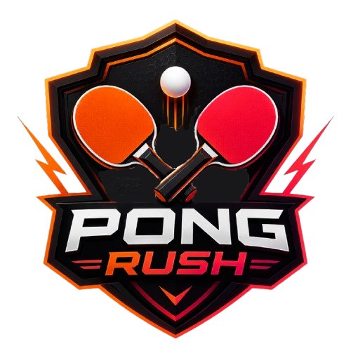

<div align="center">



# Pong Rush

### Real-Time Multiplayer Pong Game

[](https://reactjs.org/)
[](https://nodejs.org/)
[](https://expressjs.com/)
[](https://socket.io/)
[](https://www.mongodb.com/)
[](https://www.docker.com/)
[](#)

A full-stack real-time multiplayer Pong game with matchmaking, leaderboards, user authentication, and a practice mode against AI. Built with React, Express, Socket.IO, and MongoDB.

[Live Demo](https://pong-rush-six.vercel.app/login) 

</div>

---

## Table of Contents

- [Features](#features)
- [Tech Stack](#tech-stack)
- [Project Structure](#project-structure)
- [Getting Started](#getting-started)
  - [Prerequisites](#prerequisites)
  - [Installation](#installation)
  - [Environment Variables](#environment-variables)
- [Running the Project](#running-the-project)
- [Docker Deployment](#docker-deployment)
- [API Reference](#api-reference)
  - [Authentication](#authentication)
  - [Game](#game)
  - [Leaderboard](#leaderboard)
- [Socket.IO Events](#socketio-events)
- [Game Mechanics](#game-mechanics)
- [Contributing](#contributing)

---

## Features

- **Real-Time Multiplayer** -- 1v1 Pong matches with server-authoritative physics at 60 ticks/second
- **Single-Player vs AI** -- Practice against a predictive AI opponent with adjustable imperfection
- **Matchmaking** -- Queue-based matchmaking system to find opponents instantly
- **User Authentication** -- Full auth flow with JWT, password reset via email, profile management
- **Leaderboard** -- Live rankings sorted by wins with win rate calculations
- **Match History** -- Track your last 20 games with scores, opponents, and results
- **Player Stats** -- Wins, losses, win streaks, max win streak, total points, and win rate
- **Avatar Upload** -- Upload custom profile pictures via Cloudinary
- **Rich Visuals** -- Canvas rendering with paddle flash effects, ball trails, and screen shake
- **Sound Effects** -- Web Audio API beeps for hits, bounces, and scoring
- **Responsive Dark Theme** -- Glassmorphism UI with Tailwind CSS, smooth animations
- **Privacy & Legal** -- Built-in Privacy Policy, Terms of Service, Contact form, Cookie Consent
- **SEO Optimized** -- Meta tags, Open Graph, sitemap, robots.txt, semantic HTML
- **PWA-Ready** -- Web app manifest for installability on mobile and desktop
- **Docker Deployment** -- Containerized with docker-compose for one-command setup

---

## Tech Stack

### Frontend

| Technology | Purpose |
|:---|:---|
| React 18 | UI framework |
| React Router DOM 6 | Client-side routing |
| Zustand | State management with persistence |
| Socket.IO Client | Real-time WebSocket communication |
| Axios | HTTP client for API calls |
| Tailwind CSS | Utility-first styling |
| Vite | Build tool and dev server |
| React Hot Toast | Toast notifications |
| Lucide React | Icon library |

### Backend

| Technology | Purpose |
|:---|:---|
| Node.js 18+ | Runtime |
| Express | HTTP framework |
| MongoDB + Mongoose | Database and ODM |
| Socket.IO | Real-time WebSocket server |
| JSON Web Tokens | Authentication |
| bcryptjs | Password hashing |
| express-validator | Request validation |
| Nodemailer | Password reset emails |
| Helmet | Security headers |
| Jest | Testing framework |

### Infrastructure

| Technology | Purpose |
|:---|:---|
| Docker + Docker Compose | Containerized deployment |
| MongoDB Atlas | Cloud database |
| Vercel | Client-side hosting |
| Cloudinary | Avatar image hosting |

---

## Project Structure

```
Pingpong/
├── client/                          # React frontend (Vite + Tailwind)
│   ├── src/
│   │   ├── components/
│   │   │   ├── auth/                # Login, Register, ForgotPassword, ResetPassword
│   │   │   ├── lobby/               # Lobby, StatsCard, ActionsCard
│   │   │   ├── game/                # Game, GameCanvas, GameOver
│   │   │   ├── leaderboard/         # Leaderboard
│   │   │   ├── profile/             # Profile
│   │   │   └── common/              # Layout, Avatar, ErrorBoundary, NotFound, etc.
│   │   ├── stores/                  # Zustand stores (auth, game, ui)
│   │   ├── hooks/                   # useSocket, useGameLogic, useCanvas
│   │   ├── utils/                   # Constants, helpers, Cloudinary config
│   │   └── assets/                  # Logo and icons
│   ├── public/                      # Static files (404, manifest, robots, sitemap)
│   ├── vite.config.js
│   ├── tailwind.config.js
│   └── Dockerfile
│
├── server/                          # Express backend
│   ├── config/                      # Database and Socket.IO config
│   ├── models/                      # Mongoose schemas (User, GameSession)
│   ├── controllers/                 # Auth, game, leaderboard controllers
│   ├── routes/                      # API route definitions
│   ├── middleware/                   # JWT auth, error handler, validation
│   ├── services/                    # Business logic (user, game, socket)
│   ├── socket/                      # Game engine (matchmaking, physics, rooms)
│   ├── utils/                       # Validators, email, logger
│   ├── __tests__/                   # Jest test suites
│   ├── server.js                    # App entry point
│   └── Dockerfile
│
├── docker-compose.yml
├── .env.example
└── README.md
```

---

## Getting Started

### Prerequisites

- **Node.js** 18 or higher
- **npm** or **yarn**
- **MongoDB Atlas** account (or local MongoDB instance)
- **Docker** (optional, for containerized deployment)
- **Gmail** account with App Password (for password reset emails)

### Installation

1. **Clone the repository**

```bash
git clone https://github.com/iiyadh/Pong-Rush.git
cd Ping-Rush
```

2. **Install client dependencies**

```bash
cd client
npm install
```

3. **Install server dependencies**

```bash
cd ../server
npm install
```

4. **Set up environment variables**

Copy the example env files and fill in your values:

```bash
cp .env.example .env
cp ../client/.env.example ../client/.env
```

### Environment Variables

**Server (`.env`):**

| Variable | Required | Description |
|:---|:---:|:---|
| `PORT` | No | Server port (default: `5000`) |
| `MONGODB_URI` | **Yes** | MongoDB Atlas connection string |
| `JWT_SECRET` | **Yes** | Secret key for JWT signing |
| `CLIENT_URL` | No | Allowed CORS origin (default: `http://localhost:5173`) |
| `EMAIL_USER` | For emails | Gmail address for SMTP |
| `EMAIL_PASS` | For emails | Gmail App Password |
| `NODE_ENV` | No | `development` / `production` / `test` |

**Client (`.env`):**

| Variable | Required | Description |
|:---|:---:|:---|
| `VITE_API_URL` | No | Backend API URL (default: `http://localhost:5000/api`) |
| `VITE_SOCKET_URL` | No | WebSocket server URL (default: `http://localhost:5000`) |

---

## Running the Project

### Development

**Terminal 1 -- Server:**

```bash
cd server
npm run dev
```

**Terminal 2 -- Client:**

```bash
cd client
npm run dev
```

The client will be available at `http://localhost:5173` and the server at `http://localhost:5000`.

### Production

```bash
cd client
npm run build

cd ../server
npm start
```

### Tests

```bash
cd server
npm test
```

---

## Docker Deployment

```bash
docker-compose up --build
```

This starts both the client and server containers on a bridged network.

---

## API Reference

### Authentication

| Method | Endpoint | Auth | Description |
|:---:|:---|:---:|:---|
| POST | `/api/auth/register` | No | Create a new account |
| POST | `/api/auth/login` | No | Log in and receive JWT |
| POST | `/api/auth/logout` | Yes | Mark user offline |
| GET | `/api/auth/me` | Yes | Get current user profile |
| PUT | `/api/auth/username` | Yes | Update username |
| PUT | `/api/auth/password` | Yes | Change password |
| PUT | `/api/auth/avatar` | Yes | Update avatar URL |
| POST | `/api/auth/forgot-password` | No | Send password reset email |
| POST | `/api/auth/reset-password` | No | Reset password with token |

### Game

| Method | Endpoint | Auth | Description |
|:---:|:---|:---:|:---|
| GET | `/api/game/stats` | Yes | Get user game statistics |
| POST | `/api/game/stats` | Yes | Update game statistics |
| POST | `/api/game/save` | Yes | Save a local game result |
| GET | `/api/game/history` | Yes | Get match history (last 20) |

### Leaderboard

| Method | Endpoint | Auth | Description |
|:---:|:---|:---:|:---|
| GET | `/api/leaderboard` | Yes | Get ranked leaderboard |

### Health Check

| Method | Endpoint | Auth | Description |
|:---:|:---|:---:|:---|
| GET | `/health` | No | Server health check |

---

## Socket.IO Events

### Client to Server

| Event | Description |
|:---|:---|
| `find-match` | Join the matchmaking queue |
| `cancel-match` | Leave the matchmaking queue |
| `join-game` | Join a specific game room |
| `player-ready` | Signal readiness to start |
| `player-move` | Send paddle position update |
| `leave-game` | Leave the current room |
| `pause-toggle` | Request or resume pause (vote-based) |

### Server to Client

| Event | Description |
|:---|:---|
| `game-start` | Room matched, players assigned |
| `game-begin` | Both players ready, game starts |
| `game-state` | Updated ball and paddle positions |
| `game-over` | Match finished with winner |
| `game-paused` | Game paused |
| `game-resumed` | Game resumed |
| `pause-requested` | Notify of pause vote |
| `room-update` | Player list update |
| `player-disconnected` | Opponent left the game |
| `online-count` | Current player count |
| `waiting-for-match` | Confirmed in matchmaking queue |
| `match-cancelled` | Match search cancelled |

---

## Game Mechanics

| Parameter | Value |
|:---|:---|
| Canvas Size | 800 x 600 px |
| Paddle Size | 12 x 120 px |
| Paddle Speed | 6 px/frame |
| Ball Size | 12 px diameter |
| Initial Ball Speed | 4 |
| Max Ball Speed | 14 |
| Speed Acceleration | +5% per paddle hit |
| Win Condition | First to 11 points |
| Physics | Ball angle based on paddle hit position |
| AI Difficulty | Predictive trajectory with noise factor |

---

## Contributing

Contributions are welcome! Please follow these steps:

1. Fork the repository
2. Create a feature branch (`git checkout -b feature/amazing-feature`)
3. Commit your changes (`git commit -m 'Add amazing feature'`)
4. Push to the branch (`git push origin feature/amazing-feature`)
5. Open a Pull Request

---

<div align="center">

Built with passion for the love of the game

</div>
